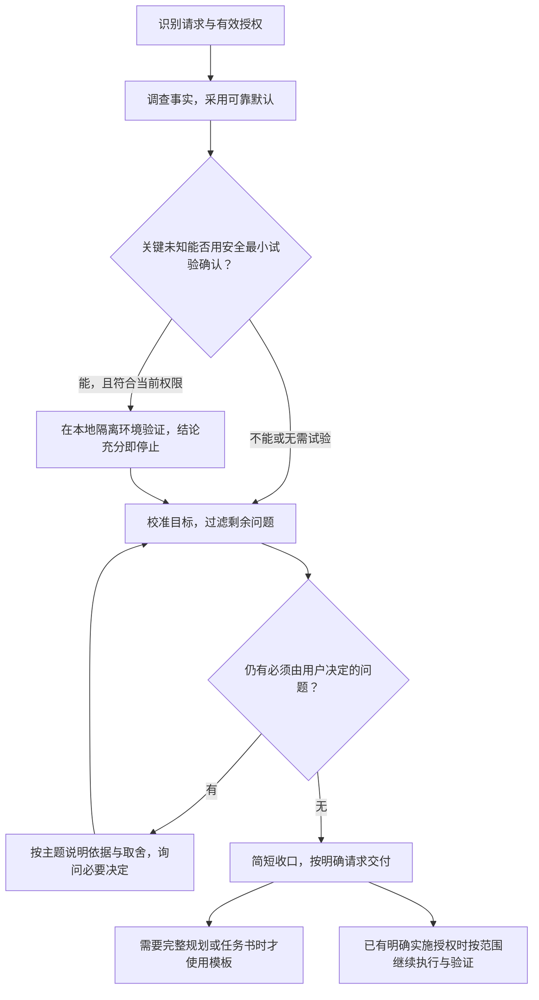

# Nate AI Skills

三个从中文 AI 工作流中持续打磨的 Agent Skills：需求榨干、提示词增强和收尾。

「需求榨干」帮助 AI 自行解决能查明、能安全验证或有可靠默认的问题，把用户的注意力留给真实意图、关键取舍和风险决定。目标是减少无意义的往返，同时保留必要的授权与验收边界。

## 仓库包含什么

| 中文名称 | 运行名 | 解决的问题 |
|---|---|---|
| [需求榨干](skills/grill-requirements/) | `grill-requirements` | 澄清真实需求，形成有依据、可验收的规划或独立执行任务书 |
| [提示词增强](skills/enhance-prompt/) | `enhance-prompt` | 保留原意，把粗略表达整理成清晰、可复制的提示词 |
| [收尾](skills/closing/) | `closing` | 核对成果、未完事项和材料去向，完成结束或交接 |

英文目录名和 `name` 保持稳定；`agents/openai.yaml` 提供中文界面说明。三个 Skill 可以分别安装。

## 需求榨干怎样工作



### 先解决事实，再询问决定

提问必须同时满足：

1. 自行调查、必要的安全最小试验、有效的既有决定或可靠默认仍不能解决。
2. 不同答案会明显改变目标、范围、优先级、成本、风险、授权边界或验收标准。
3. 仍需用户提供独有信息、明确未定意图或价值取舍、决定风险接受程度，或补充当前动作缺少的授权。

技术调查失败不等于把问题转交用户猜测。AI 应保留待验证项、说明影响，并继续可行部分；用户独有且无法查明的重要事实仍需询问。

每轮围绕一个决策主题，可合并两三个紧密关联的事项。先说明必要事实、推荐和取舍，再等待需要的决定；不以回答轮数或自评百分比决定何时收口。

### 安全最小试验

对调查仍无法确认、且会影响选择的事实，可以使用现有工具，在本地隔离环境中用临时目录或数据副本做最小验证。

- 不改正式文件、配置或业务数据。
- 不外传数据、不写外部系统、不新增付费或不可逆动作。
- 已有可靠默认时直接采用，不为走流程试验。
- 用户明确只读或禁止试验时遵守；超出边界先补齐授权。
- 获得充分结论或继续试验没有明确收益时停止。

### 校准目标与最强替代路径

先检查真实目标、当前方向的最强理由、最强可行替代及关键分歧。目标清楚时直接继续；只有高影响不确定满足提问条件时，才展示简短的“目标校准卡 · 双向钢人”，先解决最上游问题。不制造假争议，也不把推测的用户动机写成事实。

## 按请求交付

| 请求 | 交付与承接 |
|---|---|
| 普通需求讨论 | 简短说明结果、关键决定和剩余问题 |
| 明确索要完整规划 | 使用规划模板，保留范围、约束、风险和验收依据 |
| 明确索要执行任务书 | 生成可独立理解的任务书，写清目标、修改边界、基线、停车条件及证据 |
| 仅索要候选 Goal | 只提供候选摘要，标记 `CANDIDATE / NOT_AUTHORIZED` |
| 明确授权当前任务实施 | 沿有效授权连续完成修改、验证与交付 |
| 明确要求另开正式任务 | 核对宿主能力后交接、跟进并独立验收 |

普通讨论不自动附完整规划、任务书或候选 Goal。完整产物不设统一字符上限，章节按实际需要合并；关键执行边界未定时，先解决必要决定，不用猜测或空占位拼出完整任务书。

## 按需读取与长任务接续

普通需求讨论只读 [SKILL.md](skills/grill-requirements/SKILL.md)。主入口按当前需要选择材料，已读且未变的内容复用，不因后面可能用到而预加载，也不沿引用递归读取。

| 需要 | 对应材料 |
|---|---|
| 完整规划或候选 Goal | [规划模板](skills/grill-requirements/references/final-plan-template.md) |
| 独立执行任务书或补齐交接 | [任务书模板](skills/grill-requirements/references/execution-task-brief-template.md) |
| 独立正式任务创建、跟进和终验 | [正式任务交接](skills/grill-requirements/references/execution-handoff.md) |
| 多轮、多阶段或跨上下文接续 | [长任务接续](skills/grill-requirements/references/long-task-continuation.md) |
| 独立分工或已有多任务依赖 | [任务协作](skills/grill-requirements/references/task-coordination.md) |

长任务保留全部必交结果、有效决定和唯一进度位置。恢复时核对记录与现场，已有证据的成果不重做；整体完成须核验全部有效交付及共同使用结果，不能用某个分项通过代替整体完成。阶段数量本身不构成分工理由。

## 授权与能力边界

- 研究和文本生成不等于实施授权；研究期间仅允许前述边界内的安全最小试验。
- 同批有效授权覆盖后续动作时直接继续；新增范围、真实授权缺口或停车条件出现时，只暂停受影响动作，无法分离时停整体。
- 正式任务与 Goal 各需明确请求；内部代理分工不自动获得外部动作、另开正式任务或 Goal 的授权。
- 外部写入、发送、费用、安装、删除、发布及长期自动化按当前用户与项目的有效授权处理。
- 正式任务、Goal、Worktree 和跨任务回读依赖宿主实际能力；能力不可用时明确限制，只在可行且获准的范围内降级，不伪造任务标识或成功状态。
- 工作完成与回报送达分别核实；结果未知先查证，不直接重试一次性动作。执行者自报不替代独立验收。

公开版使用安装者自己的项目规则和授权。未指定经验位置时只在对话中说明，不创建私人经验库或自动继承维护权限。

## 使用示例

```text
使用 $grill-requirements 帮我判断是否需要自研报销工具。
先研究现有流程和成熟方案，只讨论，不实施。
```

```text
使用 $grill-requirements 研究这个导出文件能否被现有工具解析。
可以在本地隔离环境用数据副本做最小试验，不修改正式文件。
```

```text
使用 $grill-requirements 为另一个 AI agent 写一份登录回归修复任务书。
先核范围和验收，只生成文本，不执行。
```

## 安装与更新

### 让 Codex 安装

把所需安装项交给 Codex：

```text
请使用 $skill-installer 从 https://github.com/nate2022-ai/nate-ai-skills 安装：

- skills/grill-requirements
- skills/enhance-prompt
- skills/closing

复制所选 Skill 的完整目录，保留 SKILL.md、agents 和 references；
保持英文目录名与 name 不变，并确认安装入口可发现。
```

只需要其中部分 Skill 时删去其他安装项。更新已有安装时，先核对安装位置和本地定制，再明确授权更新所选 Skill 的完整目录；不能只替换 `SKILL.md` 而漏掉新增分支。安装器遇到已有目录时可能停止，需按实际提示处理，不能把安装请求当作无条件覆盖许可。

### 手动首次安装

以下示例安装到用户级 `.agents/skills`；若同名目录已存在，先核对现有内容与更新范围。

```bash
git clone https://github.com/nate2022-ai/nate-ai-skills.git
mkdir -p "$HOME/.agents/skills"
cp -R nate-ai-skills/skills/grill-requirements "$HOME/.agents/skills/"
cp -R nate-ai-skills/skills/enhance-prompt "$HOME/.agents/skills/"
cp -R nate-ai-skills/skills/closing "$HOME/.agents/skills/"
```

只给某个项目使用时，将所需完整 Skill 目录放入该项目的 `.agents/skills/`。安装器选择的用户级位置可能不同，以实际安装结果为准；避免为同一个 Skill 建立多个独立维护副本。

安装后在下一轮确认能否发现；若界面尚未刷新，可开启新会话。宿主具体支持方式以 [OpenAI 官方 Skills 文档](https://learn.chatgpt.com/docs/build-skills) 为准。

## 调用

显式调用稳定的英文运行名，也可用自然语言描述相应任务：

```text
$grill-requirements
$enhance-prompt
$closing
```

## 提示词增强

保留用户已表达的意图和任务性质，补清背景、限制、输出格式与完成标准；简单需求保持简短，复杂任务才展开，不把分析升级成执行。

```text
使用 $enhance-prompt 优化下面的提示词。保留原意，不新增目标；
只输出一段可直接复制的新提示词。

[粘贴原始需求]
```

## 收尾

核对实际成果、未完与阻碍、敏感及真实动作、遗留材料、接续与整体目标。简单任务不强制长报告或交接文件；中途收尾时停止原业务推进，收尾完成不代表业务目标完成。

```text
使用 $closing 收尾：核对成果和未完项，处理当前授权内的遗留，
给出必要的接续入口。
```

单纯要求停止、暂停或反馈卡顿，不触发收尾。公开版包含主入口、界面配置和四份按需分支，可单独安装；清理、经验保存和外部动作遵守安装者自己的授权。`grill-requirements` 是可选的复杂规划能力，不是收尾的安装前提。

## 本次更新（2026-09-11）

- 更新需求榨干的必要提问过滤、安全最小试验、有效授权沿用与按主题讨论。
- 普通讨论简短收口；完整规划、任务书及候选 Goal 按明确请求提供。
- 完整提供规划、任务书、正式任务交接、长任务接续及协作五份条件材料。
- 保留局部冲突处理、全部必交成果、唯一进度与独立验收。
- 更新使用、安装升级、目录结构与第三方说明；内部路径、私人维护规则及测试历史不进入公开包。

发布验证覆盖文件结构、引用、脱敏、内部源与公开版差异及隔离安装。真实使用是否持续减少打断、节省时间或 token，尚无长期量化结论；文字或结构检查不能代替实际效果验收。

## 历史更新

- **2026-09-11**：新增收尾通用公开版及安装说明（候选准备于 2026-09-10）。
- **2026-08-18**：需求榨干引入条件式目标校准、研究规划与任务书双模式、执行边界和第三方归因。

## 目录结构

```text
nate-ai-skills/
├── .gitignore
├── README.md
├── LICENSE
├── THIRD_PARTY_NOTICES.md
├── assets/
│   ├── codex-usage-overview.png
│   └── douyin-request-redacted.png
└── skills/
    ├── grill-requirements/
    │   ├── SKILL.md
    │   ├── agents/openai.yaml
    │   └── references/
    │       ├── final-plan-template.md
    │       ├── execution-task-brief-template.md
    │       ├── execution-handoff.md
    │       ├── long-task-continuation.md
    │       └── task-coordination.md
    ├── enhance-prompt/
    │   ├── SKILL.md
    │   └── agents/openai.yaml
    └── closing/
        ├── SKILL.md
        ├── agents/openai.yaml
        └── references/
            ├── handoff-and-goals.md
            ├── routing-and-writing.md
            ├── cleanup.md
            └── automation-review.md
```

## 建立缘起

最初的两个 Skill 来自长期、高频的中文 Codex 协作。在抖音分享需求榨干的使用思路后，评论区有人希望获得工具，因此建立了这个公开仓库。


<p align="center">
  
</p>

公开图片已遮盖可识别的抖音昵称、`@用户名`、头像和回复对象；不包含原始未脱敏截图。

## 方法来源与许可

- 仓库使用 [MIT License](LICENSE)。
- 需求榨干的决策树、追问和先查事实方法受到 Matt Pocock `grilling` Skill 启发。
- 任务书的写入边界、任务 0、守约验收、反向验证、止损和接续思想受到 KKKKhazix `leader` Skill 启发。
- 相关方法结合中文协作、有效授权和可验证执行重新设计；来源版本和许可原文见 [THIRD_PARTY_NOTICES.md](THIRD_PARTY_NOTICES.md)。

## 适用边界

效果取决于模型、上下文、工具权限、资料质量和宿主支持。Skill 不代替专业判断或实际验收；时效性事实、高风险结论和真实系统状态仍需可靠来源与现场验证。
