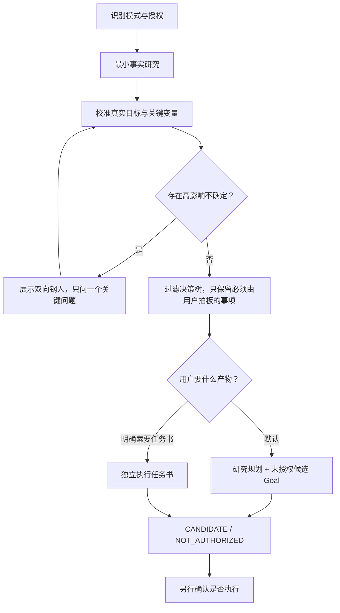
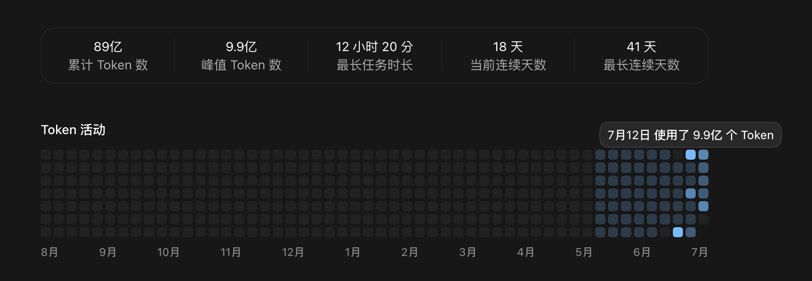

# Nate AI Skills

一组从真实中文 AI 工作流中持续打磨的 Agent Skills。

核心工具「需求榨干」不是让 AI 机械地多问问题，而是先研究事实、校准真实目标，再把当前方向和最强替代路径同时强化，找出真正会改变结论的变量。目标清楚就继续；只有存在高影响不确定时，才暂停并只问一个最关键的问题。

> 先把问题想对，再把方案做细；先交付可审阅的规划或任务书，再单独确认是否执行。

## 仓库包含什么

| 中文名称 | 运行名 | 解决的问题 |
|---|---|---|
| [需求榨干](skills/grill-requirements/) | `grill-requirements` | 把模糊、复杂或高风险的需求，转成有证据、有取舍、可验收的规划或 AI 执行任务书 |
| [提示词增强](skills/enhance-prompt/) | `enhance-prompt` | 在不改变原意和任务性质的前提下，把粗略表达整理成清晰、可复制、可验收的提示词 |
| [收尾](skills/closing/) | `closing` | 核对实际成果、未完事项和材料去向，用最小必要信息完成结束或交接 |

三个 Skill 都使用稳定的英文目录名和运行名；`agents/openai.yaml` 提供中文显示名。

## 需求榨干解决什么问题

与 AI 讨论复杂事项时，常见失败并不是“模型不会回答”，而是：

- 用户嘴上问的问题，不一定是真正想解决的问题；
- AI 容易顺着用户已有想法说，忽略更强的反方或替代路径；
- 能查明的事实被变成一长串反问，沟通成本转嫁给用户；
- 低影响细节问了很多，真正会让方案改道的变量反而没暴露；
- 规划、执行任务书和执行授权混在一起，AI 还没对齐就开始动手；
- 验收只写“完成”或“测试通过”，执行者可以用放宽标准等方式制造假绿。

「需求榨干」把这些问题收进同一条流程：



## 双向钢人：不是固定表演，而是条件式闸门

每次调用都会在内部检查四件事：

1. 用最有力、最完整的方式重述真正要解决的问题；
2. 强化当前方向成立的最好理由、条件和收益；
3. 强化最强反方或替代路径，包括不做、缩小范围、改流程或采用成熟方案；
4. 找出双方真正的分歧，以及最可能改变结论的关键变量。

关键区别在于：

- **目标已经清楚**：记录校准结果并继续，不强迫用户看一遍形式化正反辩论。
- **目标或方向存在高影响不确定**：展示“目标校准卡 · 双向钢人”，暂停下游讨论，只问一个最上游问题。
- **问题没有天然正反双方**：比较当前路径与最强可行替代路径，不为了凑格式制造假争议。

因此，它既能降低 AI 谄媚和确认偏误，也避免把每个小任务都拖成长访谈。

## 两种交付模式

### 1. 研究规划模式（默认）

适用于：

- 新项目、关键流程、产品或系统方案；
- “先研究再规划”“把需求问透”“压力测这个想法”；
- 做错后会带来明显返工、经营、安全或授权风险的事项。

最终产物包括：

- 当前状态与证据；
- 目标、范围、明确不做与优先级；
- 用户决策、AI 默认、待验证项和停车闸；
- 完整流程、异常、权限、数据、依赖、风险和分阶段路线；
- 验收矩阵；
- 一份简短的未授权候选 Goal。

### 2. 执行任务书模式（显式触发）

只有用户明确要求“给另一个 AI agent 写任务书 / brief / goal 提示词”“让 agent 独立跑”或明确要求多 agent 时才进入。

任务书会写清：

- 真实目标和冲突时的取舍顺序；
- 允许修改白名单、只读依赖、冻结判卷和明确禁区；
- 任务 0 的前提与基线核验；
- 每一步的动作、硬约束、验收证据和反向验证；
- 防作弊规则、连续失败止损、结果退化恢复和高风险停车闸；
- 结构化执行回执包。

任务书默认控制在 4000 字符以内，作为复制和审阅的兼容预算，而不是声称某个平台永远存在同一个硬上限。

## 它什么时候会问你

一个问题必须同时满足三项条件，才允许打断用户：

1. 无法从对话、项目文件、工具或权威来源查明；
2. 无法采用安全、可逆、低成本的成熟默认；
3. 不同答案会显著改变目标、范围、优先级、成本、风险、授权边界或验收标准。

符合时默认一次只问一个，并先给研究结论、推荐选项、理由和主要取舍。每完成 3 个高影响决策，会强制重新检查一次：剩下的问题是否真的还值得问。

## 安全与授权边界

生成规划或任务书时只交付文本：

- 不写代码，不修改业务文件，不操作外部系统；
- 不自动创建正式任务或 Goal；
- 不把规划完成理解为已经获得实施授权；
- 产物明确标记 `CANDIDATE / NOT_AUTHORIZED`；
- 外部写入、发送、动钱、删除、安装、长期自动化、提交、推送和发布等动作，需要单独授权。

任务书交付后，只提供三个明确选择：

1. 确认执行，并授权适合时在新正式主任务启动 Goal；
2. 确认执行，但只创建普通正式主任务；
3. 暂不执行。

正式任务、Goal、Worktree 和回流验收依赖宿主 Codex 是否提供相应能力；能力不可用或验证失败时，应安全降级为普通任务或只保留文本产物，不伪造运行状态。

## 三个使用例子

### 例 1：方向本身值得先校准

```text
使用 $grill-requirements 帮我判断：我们是否应该自研一套报销 App？先别实施。
```

AI 会比较“自研”与最强替代路径，先找出决定结论的变量，例如真实差异化需求、现有工具缺口或长期维护成本；只有变量不清且会改道时才问一题。

### 例 2：目标已清楚，直接研究规划

```text
使用 $grill-requirements 规划一个内部只读库存查询流程。数据源、用户范围和禁止写入边界已经明确。
```

目标清楚时不会为了展示双向钢人而停顿，而是先核事实、采用成熟默认，只处理仍会影响方案的高风险分支。

### 例 3：给执行 agent 写独立任务书

```text
使用 $grill-requirements 为另一个 AI agent 写一份执行任务书：修复这个仓库的登录回归问题。先生成文本，不执行。
```

AI 会进入任务书模式，冻结验收口径，写清白名单、基线、防作弊和止损，并以未授权状态交付。

## 安装

### 方法一：让 Codex 安装（推荐）

把下面这段话复制给 Codex：

```text
请使用 $skill-installer 从 GitHub 仓库 https://github.com/nate2022-ai/nate-ai-skills 安装：

- skills/grill-requirements
- skills/enhance-prompt
- skills/closing

请复制完整 Skill 目录，保留 SKILL.md、agents/openai.yaml 和 references；安装后确认所选 Skill 都能被发现。不要修改英文目录名或 SKILL.md 中的 name。
```

只需要其中部分 Skill 时，保留需要的安装项即可。

### 方法二：手动安装到当前用户

```bash
git clone https://github.com/nate2022-ai/nate-ai-skills.git
mkdir -p "$HOME/.agents/skills"
cp -R nate-ai-skills/skills/grill-requirements "$HOME/.agents/skills/"
cp -R nate-ai-skills/skills/enhance-prompt "$HOME/.agents/skills/"
cp -R nate-ai-skills/skills/closing "$HOME/.agents/skills/"
```

### 方法三：只给一个项目使用

把所需的完整 Skill 目录复制到项目中的：

```text
.agents/skills/
```

如果安装后没有立即出现，请重新启动 Codex 或开启新会话。Codex 当前的 Skill 发现位置、调用方式与安装说明以 [OpenAI 官方 Skills 文档](https://learn.chatgpt.com/docs/build-skills) 为准。

## 调用

在 Codex CLI 或 IDE 中，可以通过 `/skills` 浏览已安装 Skill，也可以显式调用：

```text
$grill-requirements
$enhance-prompt
$closing
```

自然语言也可以触发，例如：

```text
用需求榨干先把这个问题研究清楚，目标没对齐前不要实施。
```

显式运行名最稳定；中文显示名主要用于界面展示和自然语言理解，不替代英文 `name`。

## 提示词增强

「提示词增强」适合用户已经知道自己要什么，只是原始表达比较粗糙的场景。它会：

- 保留原意和任务性质，分析仍是分析，讨论不升级成执行；
- 补清必要背景、限制、输出格式和可检查的完成标准；
- 简单需求保持简短，复杂任务才结构化展开；
- 不编造上下文，不新增用户没有提出的目标。

示例：

```text
使用 $enhance-prompt 优化下面这段提示词。保留原意，不新增目标；默认只输出一段可直接复制的新提示词。

[粘贴原始需求]
```

## 收尾

「收尾」用于任务正常结束，或中途停下并整理接续。它核对实际成果、未完与阻碍、敏感及真实动作、遗留材料、接续与整体目标；简单任务不强制生成长报告或交接文件。

```text
使用 $closing 收尾：核对已完成和未完成的内容，处理当前授权范围内的遗留，并给出必要的接续入口。
```

单纯要求停止、暂停或反馈卡顿，不触发收尾。中途收尾时停止原业务推进；收尾完成不代表业务目标已完成。

本公开版包含完整的 `SKILL.md`、界面说明和四份按需分支，可单独安装。项目路由、经验保存与清理权限使用安装者自己的约定；安装 Skill 不授予删除、外部发送、系统写入或创建自动化的权限。未配置经验位置时仅在对话中说明。`grill-requirements` 是可选的复杂规划能力，不是使用收尾的前置依赖。

## 当前版更新（2026-09-10）

- 新增「收尾」及其接续、分流、清理和自动化复盘分支。
- 移除内部用户名、项目路径、固定归口和私有维护历史；清理遵守当前用户的明确授权。
- 补充收尾安装、调用和适用边界，原有两个 Skill 的运行文件未变。

## 历史更新（2026-08-18）

本次主要升级 `grill-requirements`：

- 在需求工作的最前面加入条件式“双向钢人”目标校准；
- 从“问得越细越好”调整为“先研究、只问三道准入条件都通过的高影响问题”；
- 增加研究规划与执行任务书双模式；
- 新增独立任务书模板、白名单、任务 0、冻结判卷、防作弊、反向验证和止损；
- 明确规划、任务书、执行授权、正式任务与 Goal 的分界；
- 更新 Codex 安装路径和调用说明；
- 增加 `.gitignore`，降低本机杂项误提交风险。

## 目录结构

```text
nate-ai-skills/
├── .gitignore
├── README.md
├── LICENSE
├── THIRD_PARTY_NOTICES.md
├── assets/
│   ├── codex-usage-overview.png
│   └── douyin-request-redacted.png
└── skills/
    ├── grill-requirements/
    │   ├── SKILL.md
    │   ├── agents/openai.yaml
    │   └── references/
    │       ├── final-plan-template.md
    │       └── execution-task-brief-template.md
    ├── enhance-prompt/
    │   ├── SKILL.md
    │   └── agents/openai.yaml
    └── closing/
        ├── SKILL.md
        ├── agents/openai.yaml
        └── references/
            ├── handoff-and-goals.md
            ├── routing-and-writing.md
            ├── cleanup.md
            └── automation-review.md
```

## 建立缘起

最初的两个 Skill 来自长期、高频的中文 Codex 协作。后来我在抖音分享「需求榨干」的使用思路，评论区陆续有人希望获得工具，因此建立并公开了这个仓库。



<p align="center">
  
</p>

> 隐私说明：公开图片已遮盖可识别的抖音昵称、`@用户名`、头像和回复对象；仓库中不保存原始未脱敏截图。

## 方法来源与许可

- 本仓库使用 [MIT License](LICENSE)。
- 「需求榨干」的单题追问、决策树和“能查的事实不反问”方法受到 Matt Pocock `grilling` Skill 启发。
- 执行任务书中的白名单、任务 0、防作弊验收、反向验证、止损和断点续跑思想受到 KKKKhazix `leader` Skill 启发。
- 本仓库不是逐句翻译或原样复制，而是结合中文 AI 办公、授权边界和可验证执行重新设计。
- 完整来源、固定提交和许可文本见 [THIRD_PARTY_NOTICES.md](THIRD_PARTY_NOTICES.md)。

## 适用边界

- Skill 是可复用工作方法，不保证替代专业法律、医疗、财务、安全或合规判断。
- 最终效果取决于模型能力、可见上下文、工具权限、资料质量和宿主对 Skills 的支持。
- 对时效性事实、高风险结论和真实系统状态，仍应回到可靠来源与实际验证。
