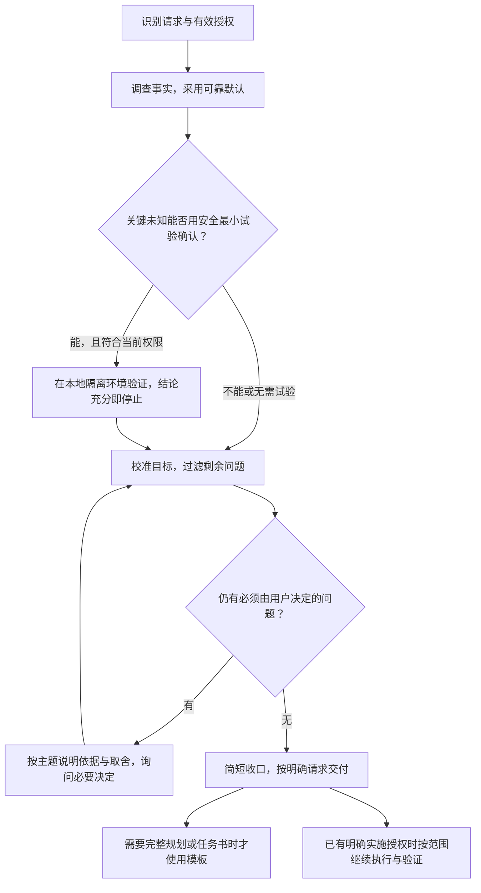
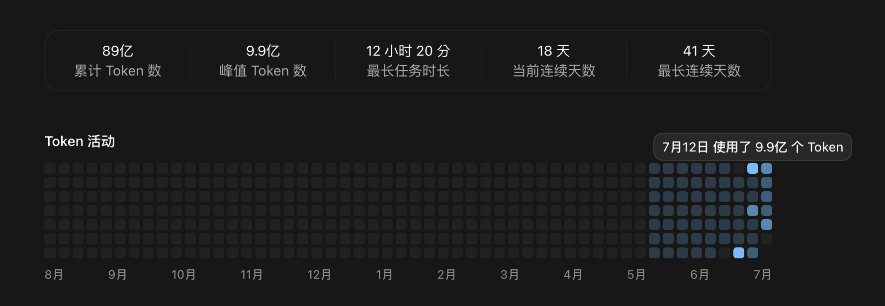

# Nate AI Skills

四个从中文 AI 工作流中持续打磨的 Agent Skills：需求榨干、提示词增强、收尾和界面设计。

「需求榨干」帮助 AI 自行解决能查明、能安全验证或有可靠默认的问题，把用户的注意力留给真实意图、关键取舍和风险决定。目标是减少无意义的往返，同时保留必要的授权与验收边界。

## 仓库包含什么

| 中文名称 | 运行名 | 解决的问题 |
|---|---|---|
| [需求榨干](skills/grill-requirements/) | `grill-requirements` | 澄清真实需求，形成有依据、可验收的规划或独立执行任务书 |
| [提示词增强](skills/enhance-prompt/) | `enhance-prompt` | 保留原意，把粗略表达整理成清晰、可复制的提示词 |
| [收尾](skills/closing/) | `closing` | 核对成果、未完事项和材料去向，完成结束或交接 |
| [界面设计](skills/interface-design/) | `interface-design` | 设计、审查、改造和验收界面，按需检索设计奖与相似案例 |

英文目录名和 `name` 保持稳定；`agents/openai.yaml` 提供中文界面说明。四个 Skill 可以分别安装。第一次查看仓库，可以先读[目录与文件夹作用](#目录与文件夹作用)。

## 需求榨干怎样工作


```mermaid
flowchart TD
    A["识别请求与有效授权"] --> B["调查事实，采用可靠默认"]
    B --> C{"关键未知能否用安全最小试验确认？"}
    C -- "能，且符合当前权限" --> D["在本地隔离环境验证，结论充分即停止"]
    C -- "不能或无需试验" --> E["校准目标，过滤剩余问题"]
    D --> E
    E --> F{"仍有必须由用户决定的问题？"}
    F -- "有" --> G["按主题说明依据与取舍，询问必要决定"]
    G --> E
    F -- "无" --> H["简短收口，按明确请求交付"]
    H --> I["需要完整规划或任务书时才使用模板"]
    H --> J["已有明确实施授权时按范围继续执行与验证"]
```

### 先解决事实，再询问决定

提问必须同时满足：

1. 自行调查、必要的安全最小试验、有效的既有决定或可靠默认仍不能解决。
2. 不同答案会明显改变目标、范围、优先级、成本、风险、授权边界或验收标准。
3. 仍需用户提供独有信息、明确未定意图或价值取舍、决定风险接受程度，或补充当前动作缺少的授权。

技术调查失败不等于把问题转交用户猜测。AI 应保留待验证项、说明影响，并继续可行部分；用户独有且无法查明的重要事实仍需询问。

每轮围绕一个决策主题，可合并两三个紧密关联的事项。先说明必要事实、推荐和取舍，再等待需要的决定；不以回答轮数或自评百分比决定何时收口。

### 安全最小试验

对调查仍无法确认、且会影响选择的事实，可以使用现有工具，在本地隔离环境中用临时目录或数据副本做最小验证。

- 不改正式文件、配置或业务数据。
- 不外传数据、不写外部系统、不新增付费或不可逆动作。
- 已有可靠默认时直接采用，不为走流程试验。
- 用户明确只读或禁止试验时遵守；超出边界先补齐授权。
- 获得充分结论或继续试验没有明确收益时停止。

### 校准目标与最强替代路径

先检查真实目标、当前方向的最强理由、最强可行替代及关键分歧。目标清楚时直接继续；只有高影响不确定满足提问条件时，才展示简短的“目标校准卡 · 双向钢人”，先解决最上游问题。不制造假争议，也不把推测的用户动机写成事实。

## 按请求交付

| 请求 | 交付与承接 |
|---|---|
| 普通需求讨论 | 简短说明结果、关键决定和剩余问题 |
| 明确索要完整规划 | 使用规划模板，保留范围、约束、风险和验收依据 |
| 明确索要执行任务书 | 生成可独立理解的任务书，写清目标、修改边界、基线、停车条件及证据 |
| 仅索要候选 Goal | 只提供候选摘要，标记 `CANDIDATE / NOT_AUTHORIZED` |
| 明确授权当前任务实施 | 沿有效授权连续完成修改、验证与交付 |
| 明确要求另开正式任务 | 核对宿主能力后交接、跟进并独立验收 |

普通讨论不自动附完整规划、任务书或候选 Goal。完整产物不设统一字符上限，章节按实际需要合并；关键执行边界未定时，先解决必要决定，不用猜测或空占位拼出完整任务书。

## 按需读取与长任务接续

普通需求讨论只读 [SKILL.md](skills/grill-requirements/SKILL.md)。主入口按当前需要选择材料，已读且未变的内容复用，不因后面可能用到而预加载，也不沿引用递归读取。

| 需要 | 对应材料 |
|---|---|
| 完整规划或候选 Goal | [规划模板](skills/grill-requirements/references/final-plan-template.md) |
| 独立执行任务书或补齐交接 | [任务书模板](skills/grill-requirements/references/execution-task-brief-template.md) |
| 独立正式任务创建、跟进和终验 | [正式任务交接](skills/grill-requirements/references/execution-handoff.md) |
| 多轮、多阶段或跨上下文接续 | [长任务接续](skills/grill-requirements/references/long-task-continuation.md) |
| 独立分工或已有多任务依赖 | [任务协作](skills/grill-requirements/references/task-coordination.md) |

长任务保留全部必交结果、有效决定和唯一进度位置。恢复时核对记录与现场，已有证据的成果不重做；整体完成须核验全部有效交付及共同使用结果，不能用某个分项通过代替整体完成。阶段数量本身不构成分工理由。

## 授权与能力边界

- 研究和文本生成不等于实施授权；研究期间仅允许前述边界内的安全最小试验。
- 同批有效授权覆盖后续动作时直接继续；新增范围、真实授权缺口或停车条件出现时，只暂停受影响动作，无法分离时停整体。
- 正式任务与 Goal 各需明确请求；内部代理分工不自动获得外部动作、另开正式任务或 Goal 的授权。
- 外部写入、发送、费用、安装、删除、发布及长期自动化按当前用户与项目的有效授权处理。
- 正式任务、Goal、Worktree 和跨任务回读依赖宿主实际能力；能力不可用时明确限制，只在可行且获准的范围内降级，不伪造任务标识或成功状态。
- 工作完成与回报送达分别核实；结果未知先查证，不直接重试一次性动作。执行者自报不替代独立验收。

公开版使用安装者自己的项目规则和授权。未指定经验位置时只在对话中说明，不创建私人经验库或自动继承维护权限。

## 使用示例

```text
使用 $grill-requirements 帮我判断是否需要自研报销工具。
先研究现有流程和成熟方案，只讨论，不实施。
```

```text
使用 $grill-requirements 研究这个导出文件能否被现有工具解析。
可以在本地隔离环境用数据副本做最小试验，不修改正式文件。
```

```text
使用 $grill-requirements 为另一个 AI agent 写一份登录回归修复任务书。
先核范围和验收，只生成文本，不执行。
```

## 安装与更新

### 让 Codex 安装

把所需安装项交给 Codex：

```text
请使用 $skill-installer 从 https://github.com/nate2022-ai/nate-ai-skills 安装：

- skills/grill-requirements
- skills/enhance-prompt
- skills/closing
- skills/interface-design

复制所选 Skill 的完整目录，保留主入口及全部配套文件；
保持英文目录名与 name 不变，并确认安装入口可发现。
```

只需要其中部分 Skill 时删去其他安装项。更新已有安装时，先核对安装位置和本地定制，再明确授权更新所选 Skill 的完整目录；不能只替换 `SKILL.md` 而漏掉新增分支。安装器遇到已有目录时可能停止，需按实际提示处理，不能把安装请求当作无条件覆盖许可。

### 手动首次安装

以下示例安装到用户级 `.agents/skills`；若同名目录已存在，先核对现有内容与更新范围。

```bash
git clone https://github.com/nate2022-ai/nate-ai-skills.git
mkdir -p "$HOME/.agents/skills"
cp -R nate-ai-skills/skills/grill-requirements "$HOME/.agents/skills/"
cp -R nate-ai-skills/skills/enhance-prompt "$HOME/.agents/skills/"
cp -R nate-ai-skills/skills/closing "$HOME/.agents/skills/"
cp -R nate-ai-skills/skills/interface-design "$HOME/.agents/skills/"
```

只给某个项目使用时，将所需完整 Skill 目录放入该项目的 `.agents/skills/`。安装器选择的用户级位置可能不同，以实际安装结果为准；避免为同一个 Skill 建立多个独立维护副本。

安装后在下一轮确认能否发现；若界面尚未刷新，可开启新会话。宿主具体支持方式以 [OpenAI 官方 Skills 文档](https://learn.chatgpt.com/docs/build-skills) 为准。

## 调用

显式调用稳定的英文运行名，也可用自然语言描述相应任务：

```text
$grill-requirements
$enhance-prompt
$closing
$interface-design
```

## 提示词增强

保留用户已表达的意图和任务性质，补清背景、限制、输出格式与完成标准；简单需求保持简短，复杂任务才展开，不把分析升级成执行。

```text
使用 $enhance-prompt 优化下面的提示词。保留原意，不新增目标；
只输出一段可直接复制的新提示词。

[粘贴原始需求]
```

## 收尾

核对实际成果、未完与阻碍、敏感及真实动作、遗留材料、接续与整体目标。简单任务不强制长报告或交接文件；中途收尾时停止原业务推进，收尾完成不代表业务目标完成。

```text
使用 $closing 收尾：核对成果和未完项，处理当前授权内的遗留，
给出必要的接续入口。
```

单纯要求停止、暂停或反馈卡顿，不触发收尾。公开版包含主入口、界面配置和四份按需分支，可单独安装；清理、经验保存和外部动作遵守安装者自己的授权。`grill-requirements` 是可选的复杂规划能力，不是收尾的安装前提。

## 界面设计

按实际内容和平台完成界面设计、审查、改造与验收。需要参考时，从Apple Design Awards、Awwwards、CSS Design Awards、UX Design Awards和Red Dot等来源查找相似案例，核实身份并提炼可迁移的方法。

```text
使用 $interface-design，为这个数据工作台查找类似的优秀设计案例，
说明值得借鉴的布局与交互、当前项目如何适配，以及哪些部分尚未验证。
```

完整方法、八篇按需参考、脱敏研究、历史Apple来源记录和许可均在同一目录内；不依赖作者的私人规则或素材库。安装者可按自己的工具、项目规则和习惯适配，见[界面设计使用说明](skills/interface-design/README.md)。

## 本次更新（2026-10-03）

- 新增可单独安装的界面设计Skill，包含设计奖与相似案例检索。
- 随包提供公开研究经过、来源导航、完整性检查和MIT许可。
- 保留证据边界：案例检索试用完成新搜索与官方文字核查，图像与真实交互未在该试用中验证；不宣称所有AI客户端和平台都已实测。

### 2026-09-21

- 补充需求榨干的显式触发说明：直接发送“需求榨干”或“把需求问透”即可触发。
- 同步两个 Skill 的经验维护说明：复用既有方法记录的相关主题；需求榨干在研究阶段仅于对话保留发现，已有实施授权后才按指定位置留证。
- 保留公开版的通用项目路由和授权边界，不携带内部经验路径或私人持续授权。

以下为 2026-09-11 已发布的主要能力：

- 更新需求榨干的必要提问过滤、安全最小试验、有效授权沿用与按主题讨论。
- 普通讨论简短收口；完整规划、任务书及候选 Goal 按明确请求提供。
- 完整提供规划、任务书、正式任务交接、长任务接续及协作五份条件材料。
- 保留局部冲突处理、全部必交成果、唯一进度与独立验收。
- 更新使用、安装升级、目录结构与第三方说明；内部路径、私人维护规则及测试历史不进入公开包。

发布验证覆盖文件结构、引用、脱敏、内部源与公开版差异及隔离安装。真实使用是否持续减少打断、节省时间或 token，尚无长期量化结论；文字或结构检查不能代替实际效果验收。

## 历史更新

- **2026-09-11**：新增收尾通用公开版及安装说明（候选准备于 2026-09-10）。
- **2026-08-18**：需求榨干引入条件式目标校准、研究规划与任务书双模式、执行边界和第三方归因。

## 目录与文件夹作用

仓库根目录的README负责介绍整套工具；真正安装的是`skills/`里的某个完整Skill目录。可以只安装需要的一个，也可以分别组合使用，不要求按固定顺序执行。

```text
nate-ai-skills/
├── README.md                    仓库总说明、使用示例和安装入口
├── LICENSE                      仓库的MIT许可
├── THIRD_PARTY_NOTICES.md        第三方方法来源与许可说明
├── assets/                      本README展示用的图片
└── skills/                      可分别安装的完整Skill包
    ├── grill-requirements/       需求榨干：研究问题、澄清取舍、形成规划
    │   ├── SKILL.md
    │   ├── agents/
    │   └── references/
    ├── enhance-prompt/          提示词增强：把已有需求写清楚
    │   ├── SKILL.md
    │   └── agents/
    ├── closing/                 收尾：核对成果、整理未完与接续
    │   ├── SKILL.md
    │   ├── agents/
    │   └── references/
    └── interface-design/        界面设计：设计、审查、改造及案例检索
        ├── README.md
        ├── SKILL.md
        ├── LICENSE
        ├── agents/
        ├── references/
        ├── research/
        └── scripts/
```

### 先选要使用的Skill

| 文件夹 | 解决什么问题 | 典型使用场景与结果 |
|---|---|---|
| [skills/grill-requirements](skills/grill-requirements/) | 在动手前查明事实、澄清关键取舍，形成可执行的需求 | “要不要开发这个工具”“先把需求问透”“给另一个AI写任务书”；输出有依据的建议、规划或交接任务书，具体形式沿请求选择 |
| [skills/enhance-prompt](skills/enhance-prompt/) | 保留已有意图，把粗略表达整理成清晰提示词 | “优化这段提示词”“整理成新对话任务说明”；交付可以复制使用的文字，适合目标已有轮廓时 |
| [skills/closing](skills/closing/) | 核对实际成果、未完成事项和材料去向，完成结束或交接 | “收尾”“中途停下，整理下一次怎么继续”；给出结果、必要整理和准确接续入口 |
| [skills/interface-design](skills/interface-design/) | 设计和改进真实界面，按需寻找相似设计参考 | “审查这个页面”“改进手机体验”“参考设计奖找类似案例”；交付方案、审查意见，或授权范围内的实现与验证 |

四个目录各自有`SKILL.md`作为入口。需要两个能力时可以配合使用，例如先澄清需求再做界面设计；不需要的Skill无需为了安装某一个而全部下载到工具的发现目录。

### agents：客户端的显示与调用配置

每个Skill的[agents/openai.yaml](skills/interface-design/agents/openai.yaml)保存Codex显示名称、简短介绍和默认调用提示；此处链接以界面设计为例。普通安装者通常不用修改。想改变显示文字或默认提示，可以在自己的版本里适配，并保持它与实际Skill能力一致。

这里的`agents`不代表配置了一支多代理团队，也不包含自动启动的服务。其他AI工具如何使用这份显示配置，以该工具实际支持方式为准。

### references：AI按任务读取的详细方法

这些文件补充各Skill主入口中的条件分支、操作方法或模板，供AI遇到相应问题时读取。它们与主入口一起组成可用方法，安装时应完整保留。

| 所在目录 | 包含哪些内容 | 什么时候读取 |
|---|---|---|
| [grill-requirements/references](skills/grill-requirements/references/) | 完整规划模板、独立执行任务书模板、正式任务交接、长任务接续和任务协作 | 用户确实需要规划、任务书、多阶段接续或分工时；普通简短需求讨论不要求全部加载 |
| [closing/references](skills/closing/references/) | 交接与Goal、材料路由与写法、清理、自动化核对四类分支 | 收尾涉及相应事项时展开，简单结束沿主入口处理即可 |
| [interface-design/references](skills/interface-design/references/) | 视觉系统、信息模式、平台适配、交互动效、用户控制、验收、案例检索、来源边界八篇专题 | 按具体设计问题选择，逐篇用途见[界面设计目录说明](skills/interface-design/README.md#references解决当前设计问题的方法) |

提示词增强目前没有`references/`子目录，其方法在自己的`SKILL.md`中。文件夹数量由实际需要决定，不要求每个Skill长成相同结构。

### research：界面设计方法的研究背景

[interface-design/research](skills/interface-design/research/)保留两类脱敏材料：方法如何形成和修正，以及Apple HIG的历史来源与阅读记录。想理解设计选择的来由、追溯来源或继续研究时可以查看，普通使用不要求通读。

`references/`提供当前任务的方法；`research/`解释研究经过、历史覆盖与限制。研究里保留的候选或未验证结论，不会自动变成现行执行要求。这里也不包含作者的私人资料库或第三方完整素材包。

### scripts：界面设计包的维护检查

[interface-design/scripts](skills/interface-design/scripts/)目前只有`check_package.py`，供维护者检查必需文件、本地链接、标题锚点及包外依赖等结构问题。修改目录、移动文件或准备重新分发后，可以按界面设计README中的命令运行。

该检查脚本需要Python 3.9或更新版本；普通调用Skill无需运行脚本。它不会自动搜集获奖网站、评价设计质量或验证所有外链。案例检索由AI按参考方法使用当前环境的搜索和浏览能力完成。

### assets：仓库首页的展示图片

[assets](assets/)存放本README中介绍仓库缘起和使用场景的图片，例如Codex使用记录、已脱敏的分享反馈截图。这些图片用于阅读仓库说明，无需一并复制到每个Skill的安装目录。

### 使用和修改时怎么处理这些目录

- **只想使用：** 选一个Skill，复制它的完整目录，按示例调用。主入口与配套文件一起保留，无需逐个手动加载。
- **只想改个人习惯：** 把语言、技术栈、审批约定、交付形式和资料保存位置写在当前请求或项目规则中。
- **想维护自己的版本：** 当前执行方法改对应`SKILL.md`或`references/`，显示文字改`agents/openai.yaml`，研究依据记在自己的研究记录中；文件改名后同步修正引用。
- **更新已安装Skill：** 先核对本地定制，再更新整个选定目录，避免只换主入口而留下旧参考文件。

## 建立缘起

最初的两个 Skill 来自长期、高频的中文 Codex 协作。在抖音分享需求榨干的使用思路后，评论区有人希望获得工具，因此建立了这个公开仓库。



<p align="center">
  
</p>

公开图片已遮盖可识别的抖音昵称、`@用户名`、头像和回复对象；不包含原始未脱敏截图。

## 方法来源与许可

- 仓库使用 [MIT License](LICENSE)。
- 需求榨干的决策树、追问和先查事实方法受到 Matt Pocock `grilling` Skill 启发。
- 任务书的写入边界、任务 0、守约验收、反向验证、止损和接续思想受到 KKKKhazix `leader` Skill 启发。
- 相关方法结合中文协作、有效授权和可验证执行重新设计；来源版本和许可原文见 [THIRD_PARTY_NOTICES.md](THIRD_PARTY_NOTICES.md)。

## 适用边界

效果取决于模型、上下文、工具权限、资料质量和宿主支持。Skill 不代替专业判断或实际验收；时效性事实、高风险结论和真实系统状态仍需可靠来源与现场验证。


